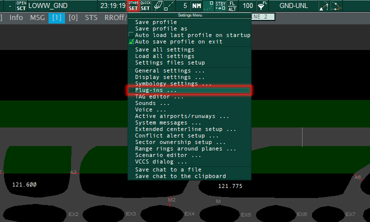
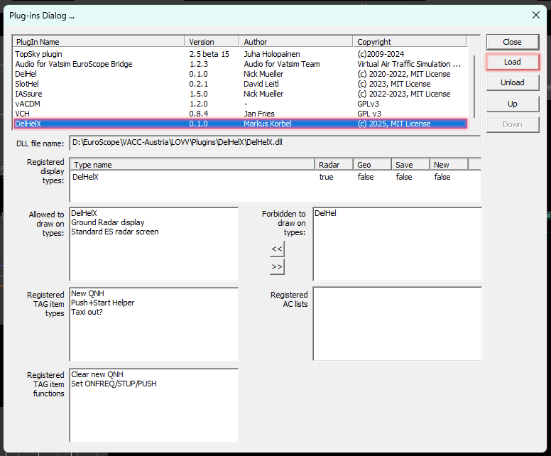
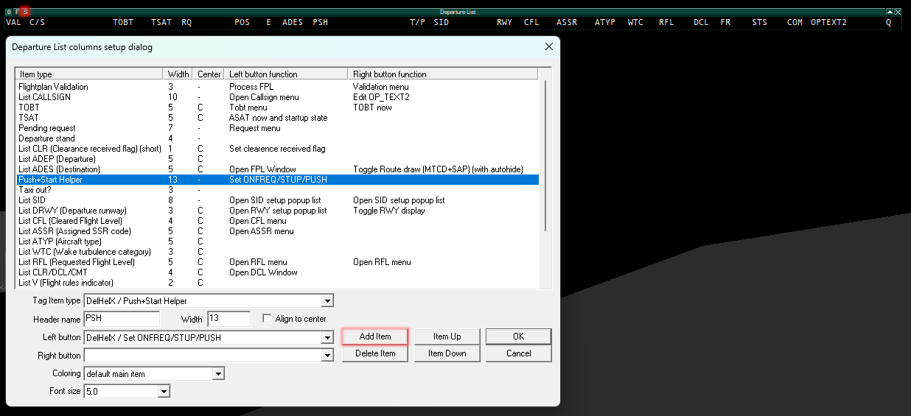
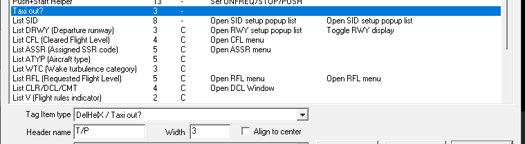
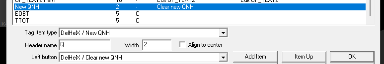

# DelHelX

`DelHelX` helps VATSIM controllers by automating delivery related checks and adding a few convenience features in EuroScope.

## Table of Contents

-   [Getting started](#getting-started)
    -   [Prerequisites](#prerequisites)
    -   [Installation](#installation)
-   [Push+Start indications](#pushstart-indications)
-   [Chat commands](#chat-commands)
-   [Contributing](#contributing)
    -   [Development setup](#development-setup)
-   [License](#license)

## Getting started

### Prerequisites

Since `DelHelX` was developed as an EuroScope plugin, it requires a working installation [EuroScope](https://euroscope.hu/). The initial development was started using EuroScope version [`v3.2.9`](https://www.euroscope.hu/wp/2020/06/28/v3-2-1-25/), although the plugin should most likely also work fine with previous and later versions. It has been tested and confirmed working with version 3.2.3. As development continues, compatibility to the latest **beta** versions of EuroScope will be maintained as long as possible and feasible.

### Installation

1. Download the latest release (`DelHelX.zip`) of `DelHelX` from the [**Releases**](https://github.com/sushiat/DelHelX/releases/latest) section of this repository
2. Extract `DelHelX.dll` and `config.json` and place both into your plugin directory (most likely somewhere inside your EuroScope sectorfile/profile setup, where other plugins are already set up)
3. Start EuroScope and open the **Plug-ins** dialog in the settings menu (**OTHER SET**)
   
4. **Load** the plugin by selecting the `DelHelX.dll` you extracted and ensure the proper version is displayed
   
   
   `DelHelX` will also confirm successful initialisation by logging its version to the **Messages** chat:
   
   `[08:34:10] DelHelX: Version 0.1.0 loaded.`
6. Close the plugin dialog and open the departure list columns setup dialog (small **S** at the left side of your departure list)
   
7. (_Optional_) Add the **Push+Start Helper** column to your departure list by clicking **Add Item** and selecting the `DelHelX / Push+Start Helper` **Tag Item type**. Pick a **Header name** and set a **Width** of 13 or greater. This column will display flight plan validations and warnings as well as next frequencies and missing suawk assignments that need to be verified before an aircraft can be released for push and start. Assign the `DelHelX / Set ONFREQ/STUP/PUSH` action as the **Left button** or **Right button** action of desired. Triggering this function will release the aircraft to the next controller or startup state/onfreq state depending of the position of the current controller.
8. (_Optional_) Add the **Taxi out?** column to your departure list, it's item type is `DelHelX / Taxi out?`. The column will display a normal "P" for aircraft requiring pushback and a green "T" for taxi out stands.
   
9. (_Optional_) Add the **New QNH** column to your departure list, it's item type is `DelHelX / New QNH`. The column will add an orange "X" to aircraft that already have clearances when a METART change contains a new QNH or Altimeter setting. After informing the aircraft and receiving the read-back, click the orange "X" to remove it, confirming this aircraft has the new QNH setting. To enable the clearing action add the `DelHelX / Clear new QNH` action to your **Left button** or **Right button** action.
   
11. Close the departure list settings by clicking **OK**

## Push+Start indications

If the column is empty the aircraft is either already past the delivery phase (at least STUP clearance) or is departing from an airport not in the config of `DelHelX`.

##### `!RWY`
Error, red  
The aircraft has no assigned departure runway.

#### `!ASSR`
Error, red
The aircraft has no assigned squawk code.

#### `!CLR`
Error, red
The aircraft has no clearance flag set.

#### `1234->OK or Freq`
Warning, orange
The aircraft has not set it's assigned squawk code, plus either OK or the next frequency. See next two entry for details.

#### `OK`
Info, green
The aircraft is cleared and ready for push+start or startup AND the current controller is at least GROUND and can issue that clearance. If the current controller is DELIVERY the next frequency will displayed instead.

#### `->121.775`
Info, green
The aircraft is cleared and ready but the current controller doesn't have the permission to issue the push+start or startup clearance. The frequency of the next controller is displayed (GND if online, then TWR, APP, CTR, etc.). If no controller above is online the UNICOM frequency of 122.8 will be displayed.

## Chat commands

Chat commands allow more fine-grained control of `DelHelX`'s behavior and some convinience functions not available via UI elements. Every chat command is prefixed with `.delhelx` and can be entered in every chat channel available. Executing `.delhelx` without any additional commands prints the version loaded and a list of commands available.

#### Toggle debug mode

`.delhelx debug`

Toggles debug mode, which adds many more log messages about the internal operation of the plugin.

This setting will be saved to the Euroscope settings upon exit.

#### Toggle update checks

`.delhelx update`

Toggles the plugin update check upon EuroScope startup.

If enabled, `DelHelX` will check this repository for newer releases of the plugin, displaying a message should an update be available.

This setting will be saved to the EuroScope settings upon exit.

#### Toggle flashing of DelHelX messages

`.delhelx flash`

Toggles flashing of unread message indicator for messages in the DelHelX group. Note that, once disabled, all `DelHelX` messages will continue to flash until you have restarted EuroScope (saving your plugin settings). This unfortunately seems to be a EuroScope limitation we cannot work around.

This setting will be saved to the EuroScope settings upon exit.

#### GND override

`.delhelx gnd`

Toggles ground "online" override. This forces DelHelX to display ground frequencies even when it doesn't detect the station online. This is useful when a tower controller has the ground frequencies cross-coupled and is anticipating a ground controller to come online shortly.

This setting will not be saved and is for the current session only.

#### TWR override

`.delhelx twr`

Toggles tower "online" override. This forces DelHelX to display tower frequencies even when it doesn't detect the station online. This is useful when an approach controller has the tower frequencies cross-coupled and is anticipating a tower controller to come online shortly.

This setting will not be saved and is for the current session only.

#### Redo clearance flags

`.delhelx redoflags`

Toggles all clearance flags for aircraft with existing clearances OFF then back ON. This allows newly joined controllers to see all aircraft with existing clearances. Use this instead of clicking them all one by one.

#### Plugin reset

`.delhelx reset`

Resets all the configuration of DelHelX to their defaults, including saved settings.

#### Disable FPLN checks (testing only)

`.delhelx nocheck`

Toggles the flight plan checks, this is a testing feature only and should never be used when actively controlling. Checks skipped are `!RWY`, `!ASSR` and `!CLR`.

#### Test QNH change (testing only)

`.delhelx testqnh`

Creates a dummy METAR for the LOWW station with a QNH of 2000 to force a change from whatever currently active value in order to trigger the NQNH strip annotation for all cleared aircraft. It doesn't change the active METAR in EuroScope but should still not be used when controlling.

## Contributing

If you have a suggestion for the project or encountered an error, please open an [issue](https://github.com/sushiat/DelHelX/issues) on GitHub. Please provide a summary of your idea or problem, optionally with some logs or screenshots and ways to replicate for the latter.  

[Pull requests](https://github.com/sushiat/DelHelX/pulls) are highly welcome, feel free to extend the plugin's functionality as you see fit and submit a request to this repository to make your changes available to everyone. Please keep in mind this plugin attempts to provide features in a relatively generic way so it can be used by vACCs with different needs - try refraining from "hard-coding" any features that might just apply to a specific airport or vACC.
This is currently a big TODO item in the initial release version of DelHelX, it's currently pretty much hard-coded to be used in LOWW only.

### Development setup

`DelHelX` currently has no external development dependencies aside [Visual Studio](https://visualstudio.microsoft.com/vs/). Initial development started using Visual Studio 2022, although later versions should most likely remain compatible.

To allow for debugging, the project has been configured to launch EuroScope as its debug command. Since your installation path of EuroScope will most likely be different, you **must** set an environment variable `EUROSCOPE_ROOT` to the **directory** EuroScope is installed in (**not** the actual `EuroScope.exe` executable), for instance `E:\EuroScope`.  
Note: triggering a breakpoint seems to cause both EuroScope and Visual Studio to freak out, resulting in high resource usage and slugging mouse movements, thus only being of limited usefulnes. **NEVER** debug your EuroScope plugin using a live connection as halting EuroScope apparently messes with the VATSIM data feed under certain circumstances.

`DelHelX` is compiled using Windows SDK Version 11.0 with a platform toolset for Visual Studio 2022 using the ISO C++17 Standard.

This repository contains all external dependencies used by the project in their respective `include` and `lib` folders:

-   `EuroScope`: EuroScope plugin library
-   `nlohmann/json`: [JSON for Modern C++](https://github.com/nlohmann/json/) ([v3.9.1](https://github.com/nlohmann/json/releases/tag/v3.9.1), [MIT License](https://github.com/nlohmann/json/blob/develop/LICENSE.MIT)), used for parsing the airport config JSON
-   `semver`: [Semantic Versioning C++](https://github.com/Neargye/semver) ([v0.2.2](https://github.com/Neargye/semver/releases/tag/v0.2.2), [MIT License](https://github.com/Neargye/semver/blob/master/LICENSE)), used for version comparison of update check

## License

[MIT License](LICENSE)
